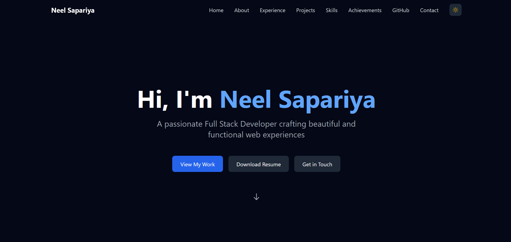

# Neel Sapariya - Portfolio

Welcome to my personal portfolio website! This is a modern, responsive web application built with Next.js and Tailwind CSS, showcasing my projects and skills as a Full Stack Developer.



## 🚀 Features

- **Responsive Design**: Seamless experience across all devices
- **Dark Mode**: Easy on the eyes with automatic theme detection
- **Smooth Animations**: Engaging user experience with Framer Motion
- **SEO Optimized**: Enhanced visibility with meta tags and structured data
- **Performance Focused**: Optimized loading with dynamic imports and image optimization
- **Accessibility**: WCAG compliant with proper ARIA labels and semantic HTML
- **Contact Form**: Integrated email functionality for easy communication

## 🛠️ Built With

- **Framework**: Next.js 14
- **Styling**: Tailwind CSS
- **Animations**: Framer Motion
- **Icons**: Heroicons
- **Email Service**: Nodemailer
- **Deployment**: Vercel

## 🌟 Sections

- **Hero**: Eye-catching introduction
- **About**: Professional background and interests
- **Experience**: Work history and achievements
- **Projects**: Showcase of key projects
- **Skills**: Technical expertise
- **Contact**: Get in touch form

## 💻 Local Development

1. Clone the repository:
```bash
git clone https://github.com/sapariyaneel/Portfolio-New.git
```

2. Install dependencies:
```bash
npm install
```

3. Create a `.env.local` file with necessary environment variables:
```env
SMTP_HOST=your_smtp_host
SMTP_PORT=your_smtp_port
SMTP_USER=your_email
SMTP_PASSWORD=your_password
```

4. Start the development server:
```bash
npm run dev
```

5. Open [http://localhost:3000](http://localhost:3000) to view the site

## 📝 License

This project is open source and available under the MIT License.

## 🤝 Contact

Feel free to reach out if you have any questions or just want to connect:

- Email: sapariyaneel9156@gmail.com
- LinkedIn: [Neel Sapariya](https://linkedin.com/in/neelsapariya)
- Twitter: [@sapariyaneel_](https://twitter.com/sapariyaneel_)
- GitHub: [@sapariyaneel](https://github.com/sapariyaneel)

---

Designed & Built with ❤️ by Neel Sapariya
